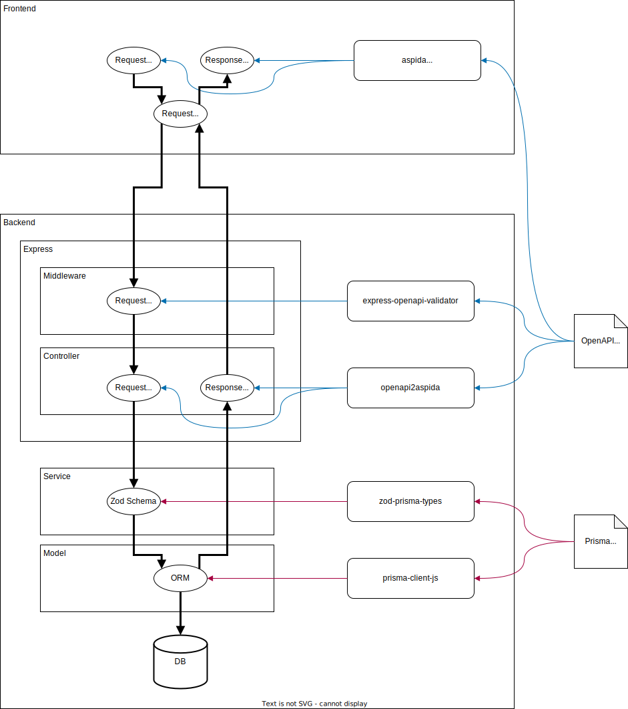

# ソフトウェア設計

## レイヤ分割

一般的なレイヤ分割の観点としては[こちらの記事](https://qiita.com/os1ma/items/66fb47f229896b32b2e8)の考え方を参考にして、Express に適合させるという観点で[こちらの記事](https://www.coreycleary.me/project-structure-for-an-express-rest-api-when-there-is-no-standard-way)を参考にしています。

Express ベースでのレイヤのイメージ（参考記事から引用）  
図では Service が直接外部 API を操作するようになっていますが、本プロジェクトでは外部 API の実行も Model が行う方針とします。（TODO: どこかで図にする）


- Route
  - エンドポイントパスと Controller の紐付け
- Controller
  - HTTP リクエストやヘッダのパース・バリデーション
  - リクエスト/レスポンスの型定義
  - Service の呼び出し
  - 処理結果とステータスコードの紐付け
- Service
  - ビジネスロジック（処理の流れ）の実装
- Model
  - データの完全性の担保（Zod でカバーしきれないバリデーション対応）
  - ビジネスロジック（処理詳細）の実装
  - PrismaClient を介したデータベースの操作
  - 外部 API/AWS の操作


## ディレクトリ構造

ディレクトリ構造もレイヤ分割で参考にした記事を参考にしています。  
route に関しては分割したくなるまでは `src/app.ts` でまとめて定義します。  
全体のエントリポイントは `src/index.ts` です。  
テストコードは `src` とディレクトリ構造を合わせ、テスト対象コードが存在する位置を再現しながら設置します。  
例えば E2E など、プロダクトのコードと直接関わりのないテストコードを作成する場合は、`tests` 直下に適切な名前のディレクトリを作成して、その中に配置するようにします。

```
❯ tree -I node_modules -I dist --dirsfirst
.
├── docker  // docker イメージの設定ファイル置き場
│   └── ...
├── docs
│   ├── ...
├── ecspresso  // ecspresso の設定ファイル置き場
│   ├── ...
├── openapi
│   └── openapi.yaml  // OpenAPI Spec
├── prisma
│   ├── migrations
│   │   ├── ...
│   └── schema.prisma  // Prisma のスキーマ
├── src
│   ├── controllers
│   │   ├── healthController.ts
│   │   └── usersController.ts
│   ├── middlewares
│   │   ├── cors.ts
│   │   ├── errorHandler.ts
│   │   └── logger.ts
│   ├── models
│   │   ├── prisma.ts
│   │   └── users.ts
│   ├── services
│   │   └── usersService.ts
│   ├── types
│   │   ├── aspida  // openapi2aspida の生成物出力先 
│   │   │   ├── ...
│   │   ├── zod
│   │   │   └── generated  // zod-prisma-types の生成物出力先
│   │   │       └── index.ts
│   │   └── env.d.ts
│   ├── app.ts  // Express のサーバ設定
│   ├── index.ts  // エントリポイント
│   └── utils.ts
├── tests  // テストコード置き場
│   ├── models
│   │   └── users.ts
│   ├── services
│   │   └── usersService.test.ts
│   └── test.ts
├── Dockerfile
├── README.md
├── compose.yaml
├── jest.config.js
├── nodemon.json
├── package-lock.json
├── package.json
├── tsconfig.json
├── tsconfig.tsnode.json
```


## スキーマとスキーマから生成したリソースの管理方針

このプロジェクトではスキーマ駆動開発を採用しています。利点としては下記の通りです。

- フロントエンドとバックエンドが疎に開発を進められる
- スキーマから生成される型情報やバリデータを活用することで定義と実装の乖離を防げる

API エンドポイントのインタフェースを管理する仕組みとして OpenAPI、DB の CRUD に関するインタフェースを管理する仕組みとして Prisma を採用しています。

どのスキーマから何が生成され、それらをどのレイヤで扱うかのイメージは下図の通りです。



実際の開発における生成手順は下記を参考にしてください。
- [OpenAPI](./dev-tasks.md#openapi-spec-の更新)
- [Prisma](./dev-tasks.md#db-スキーマprismaの更新とマイグレーション)


## 認証とセッション管理

ユーザ認証とセッション管理は AWS の Cognito + API Gateway が担当するので、本アプリケーションでは認証済みのリクエストが来る前提の実装を行います。

Cognito はあくまで認証のための情報管理を行う想定で、本アプリケーションが利用するユーザ情報は自前で管理します。
Header に付与された JWT 形式の認証済みトークンをパースし、email などの一意な項目で自前のユーザ情報のユーザを特定します。
